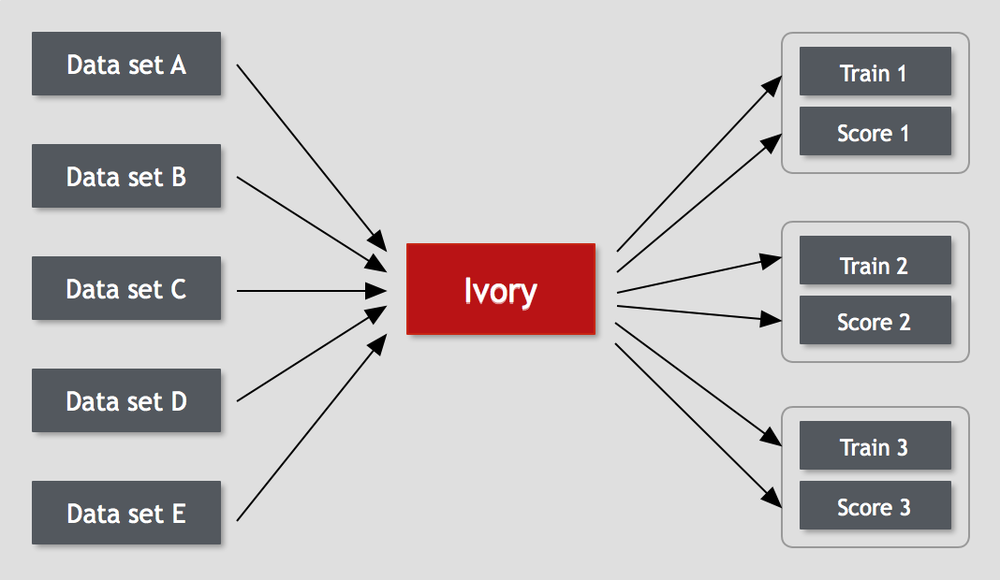

# Overview of Ivory
Ivory is an immutable and batch-oriented data repository for storing facts and extracting features.

Ivory addresses the real-world problems of:

*Data wrangling* - multiple data sources, feature engineering, modelling.

*Dev ops* - continuous data flow, continuous training and scoring of models, data correction, on-the-fly model extension.

Ivory can be used within a large machine learning pipeline for normalising data and providing feeds to model training and scoring pipelines.

Ivory is scalable and extensible, and

Ivory provides reliable storage - backed by HDFS and S3.

Ivory provides operational simplicity...
